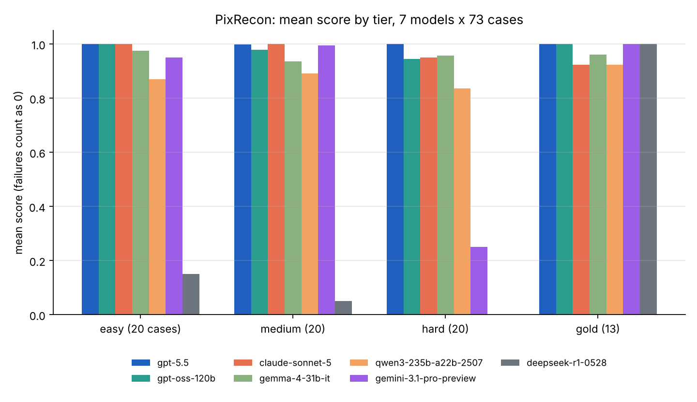
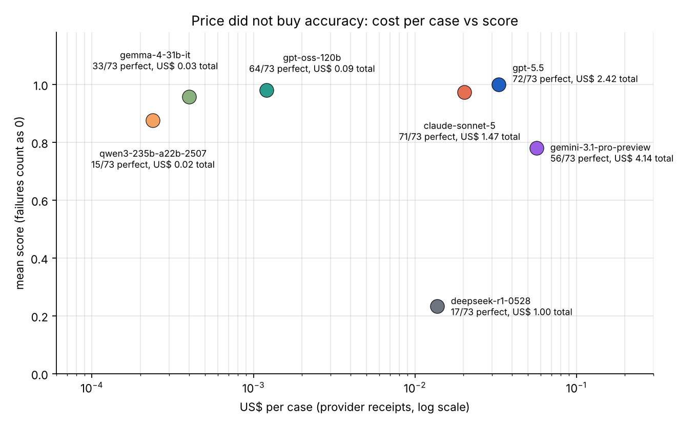

# PixRecon: a Pix reconciliation benchmark for language models

PixRecon asks a model to do the job a store does every morning: match each order to the Pix transfers that actually arrived and name the exceptions. Each of the 73 cases hands the model a list of orders (id, amount, created and expiry instants) and a bank statement (transfers with end-to-end id, amount, time, payer, an optional txid and a free-text description). The answer is one JSON object with a status for every order (`paid`, `unpaid`, `underpaid`, `overpaid`, `late_paid`, `refunded`), the transfers linked to it, and the orphan transfers that match no order.

Grading is deterministic (no LLM judge): `grader/grader_v4.py` checks the exact schema first and then the content, and reports three numbers per answer: `content_score` in [0, 1], `schema_valid`, and `score` = content_score if the schema is valid, else 0.

This repository contains the frozen fictional cases, exact prompt, deterministic grader, seven-model grid called directly through OpenRouter, provider receipts and analysis, plus the exact notebook source submitted to Kaggle BuildTask. Kaggle Task Page links will be added after their publication is confirmed. Historical Kaggle I0 results are separate from this grid; see `RESULTS-PROVENANCE.md`.

## Layout

- `cases/CASES.json`: the 73 frozen cases (`case_id`, `tier`, `exceptions`, `orders_json`, `statement_json`, `expected_json`). Tiers: easy, medium, hard, plus the gold cases (`g01`…) that pin one rule each.
- `PROMPT.md` and `prompt/prompt.py`: the complete rules and exact input-construction recipe.
- `kaggle/pixrecon-kaggle-task.ipynb`: the exact notebook source submitted to Kaggle BuildTask version 1 (job `356568120`), using Kaggle Benchmarks SDK `0.6.1`.
- `grader/grader_v4.py`: the grader. `grade(answer_text, expected_json) -> {"score", "content_score", "schema_valid", "perfect", ...}`.
- `runs/openrouter-grid-2026-10-07/`: the seven-model grid: 511 logical (model, case) receipts and 520 direct transport attempts, including nine transport-level 429 retries.
  - `GRID-511.csv`: one row per pair (model, case, tier, score, content_score, schema_valid, perfect, tokens, cost in USD, provider, finish reason, hashes of the answer and the raw response).
  - `raw/*.json`: the raw provider responses as returned through OpenRouter (content, usage, cost, generation id). Files are named `<label>-<case_id>.json`, label I1…I7 being the model index in `GRID-511.csv`; This folder contains the 511 selected final responses, rather than every transport attempt. A `#2` suffix identifies a selected retry response; the nine earlier failed transport attempts are represented by the audit summary and remain outside the selected-response set.
  - `CATALOG-7.json`: the model catalog entries at run time (pricing and context length).
  - `AUDIT-PUBLIC-SUMMARY.json`: a public summary derived from the frozen audit, excluding personal API-key quota/configuration. Unknown failed-attempt costs remain unknown.
- `analysis/`: `k3b_grid_analysis.py` (reads the grid and the raw answers, regrades everything with the grader and produces the tables), `numbers.json` and `tables.md` (its output).
- `figures/`: score by tier and cost versus score.

## Results of the grid (73 cases per model, max_tokens 8,192, provider defaults otherwise)

| Model | Mean score | Perfect cases | Known receipt cost (USD) |
|---|---|---|---|
| openai/gpt-5.5 | 0.999 | 72 | 2.42 |
| openai/gpt-oss-120b | 0.979 | 64 | 0.09 |
| anthropic/claude-sonnet-5 | 0.973 | 71 | 1.47 |
| google/gemma-4-31b-it | 0.957 | 33 | 0.03 |
| qwen/qwen3-235b-a22b-2507 | 0.876 | 15 | 0.02 |
| google/gemini-3.1-pro-preview | 0.780 | 56 | 4.14 |
| deepseek/deepseek-r1-0528 | 0.233 | 17 | 1.00 |

Mean score counts a schema failure (prose before the JSON, two JSON documents, a duplicate key) and an empty answer as 0, which is the rule the benchmark publishes. The write-up explains the low Gemini and DeepSeek numbers (hard truncation at the token cap and empty outputs, not reconciliation mistakes) and the UTC-offset error that separates Qwen and Gemma from the top three.

## Kaggle notebook source

[The Kaggle notebook](https://www.kaggle.com/code/rafaorlando3/pixrecon-pix-statement-reconciliation-benchmark) uses the source archived at `kaggle/pixrecon-kaggle-task.ipynb`. Its complete file SHA-256 is `b11620a60fdb19d8623a8e0fb587e4a66ddceef9672369a626cf64f744efb760`. The notebook asserts Kaggle Benchmarks SDK `0.6.1`, embeds the exact 73-case JSON bytes (SHA-256 `58603636de7b52b7f75edc1382de15c366ca249fad296a1dce351e22df207f96`), and checks normalized case content hash `a12787bb7dfa021192509942198d2b714e500cd8969215ec1e070918da6e1e29`.

Kaggle BuildTask executes the notebook. The submitted source calls `pixrecon.run(kbench.llm, cases)` with Kaggle's default model selection; its model calls are separate from the frozen seven-model OpenRouter grid above. The effective model and result of this BuildTask job have not yet been confirmed, and the archived source contains no execution outputs. Uploading this source to the repository did not start another run. See `REPRODUCE.md` before executing it.

## Reproduce the grading

```bash
python3 -c "
import json, sys
sys.path.insert(0, 'grader')
from grader_v4 import grade
cases = {c['case_id']: c for c in json.load(open('cases/CASES.json'))}
raw = json.load(open('runs/openrouter-grid-2026-10-07/raw/I1-easy-000.json'))
answer = raw['choices'][0]['message']['content']
print(grade(answer, cases['easy-000']['expected_json']))
"
```

The existing audit reports an exact offline regrade. `REPRODUCE.md` describes the input layout required by `analysis/k3b_grid_analysis.py`; publishing this repository does not run it or call a model.

## License

Cases, prompt, grader and analysis: MIT. Raw model outputs are published as received for audit purposes.

## Data and cost boundaries

All 73 cases are fictional benchmark data; payer labels are synthetic, not customer records. See `DATA.md`.

The grid has US$9.1675127075 in known provider receipt costs. The API usage reading was US$9.16998029, leaving an unreconciled US$0.0024675825 delta. Nine failed 429 attempts retain US$0.0421163483 in reservations; their unknown costs were not converted to zero. Historical Kaggle I1 cost NULL/UNKNOWN is a different record and is not the valid OpenRouter `raw/I1-easy-000.json` used in the example above.




